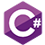

# NotesApp 📔✏️
This is my personal project notes app example of a full-stack web application. Using C# with ASP.NET web api for the backend. And Angular with typescript for the frontend communicating via RESTful api.

  

### Features ⭐
- Entity Framework Core: The application uses Entity Framework Core as the ORM to interact with the underlying database.
- User Authentication and Authorization via JWT.
- Repository Pattern: The application follows the repository pattern to separate data access logic from business logic.
- Responsive UI: The application provides a responsive user interface built with custom css.

### Prerequisites 📦
- .NET Core 6.0
- SQL Server (or any other supported database) installed and configured
- node.js 18 or later
- Angular 16

### Installation ⚙️
1. Clone the repository: `git clone https://github.com/KristijanJankuloski/NotesApp.git`
2. Open in prefered IDE
3. Configure connection string in `appsettings.json`
4. Update database from migrations
5. Start api application
6. Start angular application with `ng serve` or `npm run dev`

### Project Structure 🏗️
- `Api` containing the api app itself
- `DTOs` for all data transfer objects
- `DataAccess` containing all the repositories context and migraitons
- `Domain` for all the domain models
- `Helpers` for shared helping funcions
- `Mappers` for all the mapping between Domain models and DTOs
- `Services` for all the services that api controllers will use
- `Frontend` containing the angular application itself
